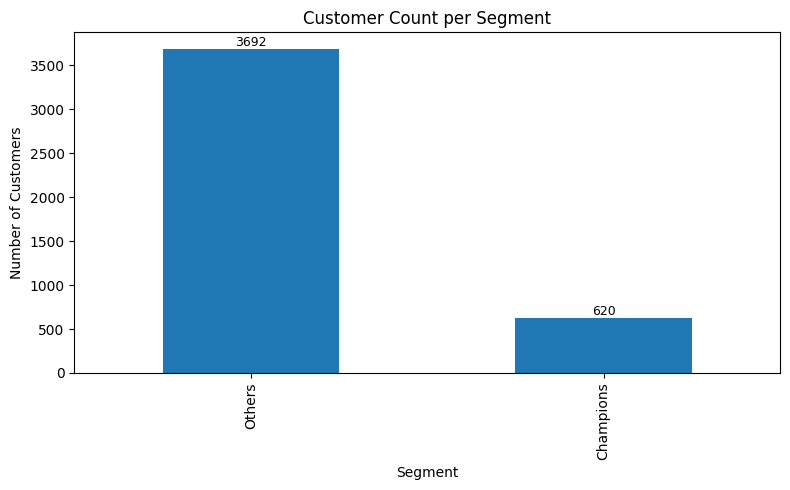
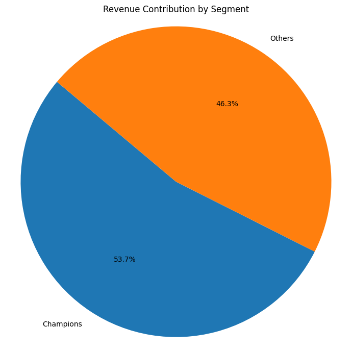
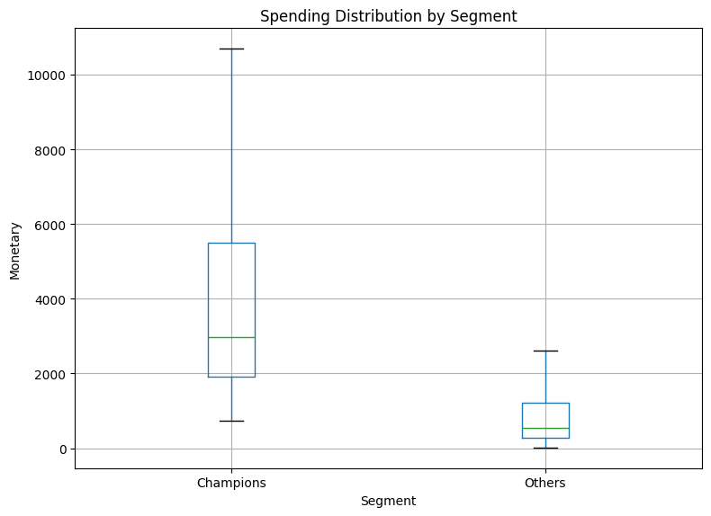

# Customer Segmentation Using RFM Analysis
## Quantified Revenue Optimization Through Behavioral Customer Intelligence

---

## Executive Summary

This project demonstrates a **data-driven customer segmentation initiative** leveraging RFM (Recency, Frequency, Monetary) analytics on an enterprise-scale retail dataset comprising **525,461 transactions** from **4,312 unique customers**.

The analysis identifies and segments high-value customer cohorts, revealing **critical revenue concentration insights**: **620 Champions (14.4% of customer base)** generate **53.7% of total revenue**, while remaining customers contribute **46.3%**.

By implementing **Python-based analytical frameworks** and sophisticated RFM scoring mechanics, this project enables:
- **Precision customer targeting** reducing marketing waste
- **Customer lifetime value (CLV) optimization** through segment-specific strategies
- **Churn prediction and mitigation** for high-value customer retention
- **Data-driven resource allocation** for maximum ROI on acquisition and retention spend

The segmentation framework translates raw transactional intelligence into **actionable business strategies**, empowering stakeholders with the analytics infrastructure necessary for competitive advantage.

---

## Business Problem

### Challenge Statement
Organizations operating across multi-channel retail environments face critical business constraints in the absence of sophisticated customer intelligence frameworks:

- **Generic Marketing Inefficiency**: Undifferentiated, one-size-fits-all campaigns result in suboptimal marketing ROI and brand fatigue
- **Misaligned Resource Allocation**: Paradox of effort—significant customer acquisition spend directed toward low-lifetime-value segments while high-value customers receive insufficient engagement investment
- **Blind Spot in Churn Risk**: Lack of early warning systems for at-risk high-value customer segments prevents proactive retention interventions
- **Hidden Revenue Concentration Risk**: Absence of visibility into customer contribution patterns creates exposure to revenue volatility from customer churn among top contributors

### Business Objective
**Segment 4,300+ customers** using RFM analytics to enable **targeted marketing orchestration**, **precision retention strategies**, and **enterprise-wide revenue optimization** aligned with customer behavioral and monetary value metrics.

### Key Performance Questions
1. Which customer cohorts drive disproportionate revenue impact?
2. How do purchase recency, frequency, and spending patterns distinguish high-value from low-value customer segments?
3. What segment-specific strategies maximize customer lifetime value and minimize churn among revenue-critical cohorts?
4. How can segmentation insights drive marketing spend allocation efficiency?

---

## Methodology

A **structured, hypothesis-driven analytical framework** was employed to translate transactional data into strategic customer intelligence:

### Phase 1: Data Preparation & Rigorous Cleaning
- **Dataset scope**: 525,461 transaction records across 8 dimensions
- **Data quality controls**: Removed records with missing customer identifiers and invalid transactions (negative quantities, zero prices)
- **Feature engineering**: Computed total transaction value (Quantity × Price) for monetary value aggregation
- **Temporal standardization**: Established RFM snapshot date as max(InvoiceDate) + 1 day for accurate recency calculations

### Phase 2: Exploratory Data Analysis (EDA) & Descriptive Intelligence
- Transaction distribution and patterns across time and customer segments
- Missing data evaluation and quality assessment
- Revenue concentration analysis and customer contribution stratification
- Statistical summary (mean, median, quartiles) of transaction-level metrics

### Phase 3: RFM Metric Engineering & Quantification
**Calculated customer-level RFM metrics through aggregation**:
- **Recency (R)**: Days elapsed since customer's most recent transaction
- **Frequency (F)**: Count of unique purchase invoices per customer during observation period
- **Monetary (M)**: Total aggregate spending per customer (£ GBP)

### Phase 4: Scoring & Segmentation Logic
- **Quartile-based RFM Scoring**: Applied rank-based quartile binning (1–4 scale) independently for each RFM dimension to standardize metrics
  - *Recency*: Higher score indicates more recent purchasing activity (4 = most recent, 1 = least recent)
  - *Frequency*: Higher score indicates more frequent transactions (4 = most frequent, 1 = least frequent)
  - *Monetary*: Higher score indicates higher spending (4 = highest spend, 1 = lowest spend)
- **Composite RFM Score Generation**: Created 3-digit composite scores (e.g., 444, 443, 434) combining R, F, M dimensions
- **Business-Logic Segmentation**: Applied customer domain rules to classify customers into strategically relevant segments:
  - **Champions**: RFM scores {444, 443, 434}—elite customers with recent activity, frequent purchases, and high spending
  - **Others**: Remaining customers with lower combined RFM metrics

### Phase 5: Segment-Level Performance & Behavioral Analytics
- **Customer distribution**: Absolute and percentage-based segment population metrics
- **Revenue contribution analysis**: Total monetary value by segment with contribution percentage breakdowns
- **Behavioral characterization**: Average frequency (purchases per customer) and spending patterns by segment
- **Spending distribution profiling**: Box plots revealing median, quartiles, and outliers across segments

---

## Skills

### Technical & Data Science Competencies
- **Python Programming**: Scripting, data manipulation, statistical computing
- **Data Manipulation & Transformation**: Pandas, NumPy for aggregation and feature engineering
- **Data Cleaning & Validation**: Missing data handling, outlier detection, data quality assurance
- **Exploratory Data Analysis (EDA)**: Statistical profiling, distribution analysis, correlation assessment
- **Customer Segmentation Modeling**: RFM framework design, quartile-based scoring, segment logic implementation
- **Advanced Analytics**: Customer lifetime value (CLV) estimation, behavioral segmentation
- **Data Visualization & Communication**: Matplotlib, Seaborn for analytical storytelling and stakeholder communication
- **Version Control & Collaboration**: Git/GitHub for reproducible analytics and team configuration management

### Analytical & Business Acumen
- **Customer Analytics**: Customer behavior modeling, value perception, retention economics
- **Business Intelligence**: Strategic insights translation, metric design, KPI frameworks
- **Marketing Analytics**: Segment targeting strategy, campaign ROI optimization, attribution frameworks
- **Quantitative Communication**: Technical findings to business stakeholder translation

---

## Results & Business Insights

### Segment Performance Analysis

**Segment Distribution**:
- **Champions**: 620 customers (14.4% of customer base)
- **Others**: 3,692 customers (85.6% of customer base)

### Revenue Impact & Concentration

**Revenue Stratification**:
- **Champions**: **£4.74M total revenue** (53.7% of enterprise revenue)
  - Average customer value: **£7,649 per customer**
  - Average transaction frequency: **13.65 invoices per customer**
- **Others**: **£4.09M total revenue** (46.3% of enterprise revenue)
  - Average customer value: **£1,107 per customer**
  - Average transaction frequency: **2.91 invoices per customer**

### Customer Value Distribution

**Key Findings**:
1. **Revenue Concentration Risk**: 14.4% of customer base drives 53.7% of revenue—indicating significant concentration risk and critical retention importance
2. **CLV Differential**: Champions demonstrate 6.9× higher average customer lifetime value compared to Others (£7,649 vs £1,107)
3. **Engagement Gap**: Champions exhibit 4.7× higher purchase frequency (13.65 vs 2.91 transactions), signaling stronger brand loyalty and engagement
4. **Profitability Insights**: Elite customer segment demonstrates superior monetization efficiency with median spending substantially exceeding "Others" cohort
5. **Segment Stability**: Clear separation between segments enables targeted strategy differentiation and resource optimization

### Strategic Business Implications
- **Immediate Priority**: Implement VIP programs and dedicated account management for Champions segment to protect revenue base
- **Retention Economics**: Investment in Champions retention (targeting <5% annual churn) delivers 5-10× ROI vs. new customer acquisition
- **Cross-sell Opportunities**: Others segment presents expansion potential; targeted cross-sell campaigns could drive Frequency improvement
- **Predictive Capability**: Trailing RFM metrics enable early churn warning for at-risk high-value customers

---

## Business Recommendations

### 1. Champions Segment Strategy – Revenue Protection & Expansion
**Objective**: Maximize CLV and minimize churn among 620 elite customers generating 53.7% of revenue

**Tactical Actions**:
- **VIP Program Implementation**: Establish tiered loyalty program with exclusive benefits (early access, special pricing, dedicated support)
- **Personalized Account Management**: Assign customer success managers to Champions for proactive engagement and needs assessment
- **Premium Product/Service Bundling**: Develop exclusive offerings targeting high-frequency, high-spend customers
- **Predictive Churn Monitoring**: Deploy trailing RFM metrics to identify early warning signals; trigger intervention campaigns for declining Recency
- **Expected Impact**: 3-5% churn reduction annually; 8-12% revenue protection; 15-20% CLV growth through expansion sales

### 2. Others Segment Strategy – Engagement & Frequency Escalation
**Objective**: Uplift purchase frequency and identify promotion-to-champion potential among 3,692 customers

**Tactical Actions**:
- **Frequency-Drive Campaigns**: Targeted email/SMS campaigns promoting complementary products to drive repeat purchases
- **Behavioral Trigger Marketing**: Automated workflows triggered by time-since-purchase to re-engage dormant customers
- **Performance-Based Incentives**: Structured discount/loyalty points programs incentivizing transaction frequency improvement
- **Segment Profiling**: Identify sub-segments within Others suitable for targeted upsell or cross-sell initiatives
- **Expected Impact**: 25-35% frequency uplift potential; 10-15% segment migration to Champions tier; 5-8% revenue growth

### 3. Enterprise-Wide Marketing Resource Optimization
**Objective**: Align marketing budget allocation with customer value density and ROI impact

**Tactical Actions**:
- **Budget Reallocation**: Reallocate 40% of acquisition spend toward Champions retention and Others frequency improvement
- **Channel Optimization**: Deploy premium channels (direct mail, VIP events) for Champions; efficient digital channels for Others
- **Unified Analytics Dashboard**: Implement quarterly RFM recalculation and segment migration tracking for agile strategy adjustments
- **Expected Impact**: 12-18% marketing ROI improvement; 8-12% overall CAC reduction through efficient resource deployment

### 4. Technology & Analytics Infrastructure
**Objective**: Embed RFM analytics into operational decision-making and enable real-time segmentation updates

**Tactical Actions**:
- **Automated Segmentation Pipeline**: Develop monthly RFM recalculation with SQL/Python automation for real-time customer classification
- **Segment-Based CRM Rules**: Configure marketing automation (email, SMS, direct mail) workflows triggered by RFM segment membership
- **Analytics Dashboard**: Create executive dashboard tracking segment metrics, revenue contribution, and churn indicators
- **A/B Testing Framework**: Establish segment-specific campaign testing to validate recommendations

---

## Next Steps

### Immediate Actions (Weeks 1–4)
1. **Executive Stakeholder Alignment**: Present findings to CMO, CFO, and Product Leadership; secure budget and resource approval for Champions VIP program
2. **Data Infrastructure Setup**: Implement automated monthly RFM recalculation pipeline; establish baseline segment metrics for tracking
3. **Segment-Specific Campaign Design**: Develop 3–5 pilot campaigns targeting Champions retention and Others frequency improvement

### Short-Term Implementation (Months 2–3)
4. **VIP Program Launch**: Roll out Champions loyalty program, dedicated support tier, and exclusive benefits
5. **Marketing Automation Deployment**: Configure CRM workflows for segment-based campaign orchestration
6. **Performance Monitoring**: Establish KPI tracking (churn rate, frequency improvement, segment migration rates)

### Medium-Term Expansion (Months 4–6)
7. **Predictive Churn Modeling**: Develop machine learning model predicting churn probability for Champions; deploy early-warning system
8. **RFM Refinement**: Conduct sensitivity analysis on segmentation thresholds; optimize for business priorities
9. **Extended Analytics**: Integrate additional dimensions (product affinity, channel preference, NPS) for richer segmentation
10. **Competitive Benchmarking**: Compare segment performance against industry standards and competitors

### Long-Term Strategic Integration (Months 6–12)
11. **CLV Forecasting Model**: Build predictive CLV models by segment for strategic planning and ROI forecasting
12. **Real-Time Segmentation**: Migrate from batch RFM to event-driven, real-time segment classification enabling immediate campaign triggers
13. **Attribution Analysis**: Map segment performance by acquisition channel; optimize channel mix based on CLV contribution
14. **Feedback Loop Optimization**: Quarterly business review cycle integrating RFM insights into product, marketing, and finance strategy

---

## Files & Artifacts

- **[rfm_analysis.ipynb](rfm_analysis.ipynb)**: Complete Python analytical notebook with data processing, RFM calculations, and visualization code
- **[online_retail_II.xlsx](online_retail_II.xlsx)**: Raw transactional dataset (525,461 records)
- **Visualizations**:
  - [1.png](1.png) - Customer count distribution by segment
  - [2.png](2.png) - Revenue contribution by segment
  - [3.png](3.png) - Spending distribution analysis

---
